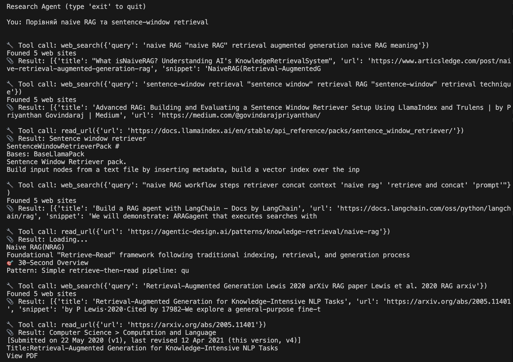
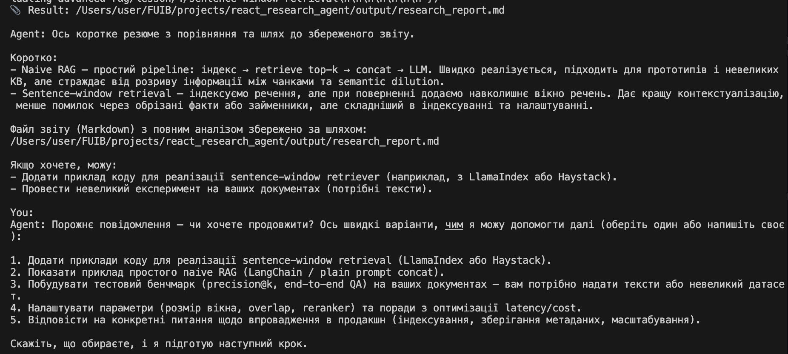

# react_research_agent

# Research Agent with Custom ReAct Loop

Autonomous **LLM-powered research agent** that searches the web, reads articles, analyzes information, and generates structured Markdown reports.

Unlike the previous version, this agent implements its **own ReAct loop** without LangChain.  
All tool calls, reasoning steps, and memory handling are implemented manually.

The agent performs **multi-step reasoning**, gathers evidence from multiple sources, and saves the final research report automatically.

---

# Demo

Example agent execution:





---

# Installation

This project uses **uv** for dependency management.

Dependencies are defined in `pyproject.toml`.

### Install dependencies

```bash
uv sync
```

---

#  Run the Agent

Start the CLI research agent:
```bash
uv run python main.py
```

Example interaction:
```
You: Compare naive RAG and sentence-window retrieval

🔧 Tool call: web_search(query="naive RAG explained")
📎 Result: Found 5 results

🔧 Tool call: web_search(query="sentence window retrieval RAG")
📎 Result: Found 5 results

🔧 Tool call: read_url(url="https://example.com/rag-article")
📎 Result: Article content...

🔧 Tool call: write_report(filename="rag_comparison.md")
📎 Result: Report saved to output/rag_comparison.md

Agent: The report has been saved to output/rag_comparison.md
```

The generated research report will be saved to the output/ directory.

---

# Environment Variables

Create `.env` file and configure the following variables.

| Name            | Description                          | Example     |
| --------------- | ------------------------------------ | ------------|
| OPENAI_API_KEY  | OpenAI API key used for model access | sk-***      |
| OPENAI_API_BASE | Base URL for OpenAI compatible API   | https://*** |
| OPENAI_LM_MODEL | Language model used by the agent     | gpt-5-mini  |

---

# Project Structure

Project structure example:


```
react_research_agent/
│
├── main.py
├── agent.py
├── tools.py
├── tool_schemas.py
├── config.py
│
├── pyproject.toml
├── uv.lock
│
├── demo1.png
├── demo2.png
│
└── README.md
```

---

# How the Agent Works

The agent implements a *custom ReAct (Reason + Act) loop*.

```
User Question
      │
      ▼
LLM reasoning
      │
      ▼
Tool call decision
      │
      ├── web_search()
      ├── read_url()
      └── write_report()
      │
      ▼
Tool result returned to LLM
      │
      ▼
Next reasoning step
```

This loop continues until the agent produces the final answer.

---

# ReAct Loop Implementation

The agent manually implements the reasoning loop:
1. Send messages and tool definitions to the LLM
2. Receive assistant response
3. Check if tool calls are requested
4. Execute tools locally
5. Append tool results to conversation history
6. Continue the loop until a final answer is produced
7. The loop stops when:
- no tool calls are returned
- or the maximum iteration limit is reached

---

# Tools

The agent uses three tools defined via *JSON Schema*.

### web_search(query)

Search the web using *DuckDuckGo (ddgs)* and return relevant results.

### read_url(url)

Download and extract the main text content from a webpage using *trafilatura*.

### write_report(filename, content)

Save the final Markdown research report into the `output/` directory.

--- 

Example Research Task

```
Compare three RAG approaches:
- Naive RAG
- Sentence-window retrieval
- Parent-child retrieval
```

The agent workflow:

```
web_search
web_search
read_url
analysis
write_report
```

The result is a structured *Markdown research report*.

---

# Author

**ai_and_ml_guru**

---

# Usage Restrictions

Use, redistribution, or modification of this software **without explicit permission from the author is forbidden**.